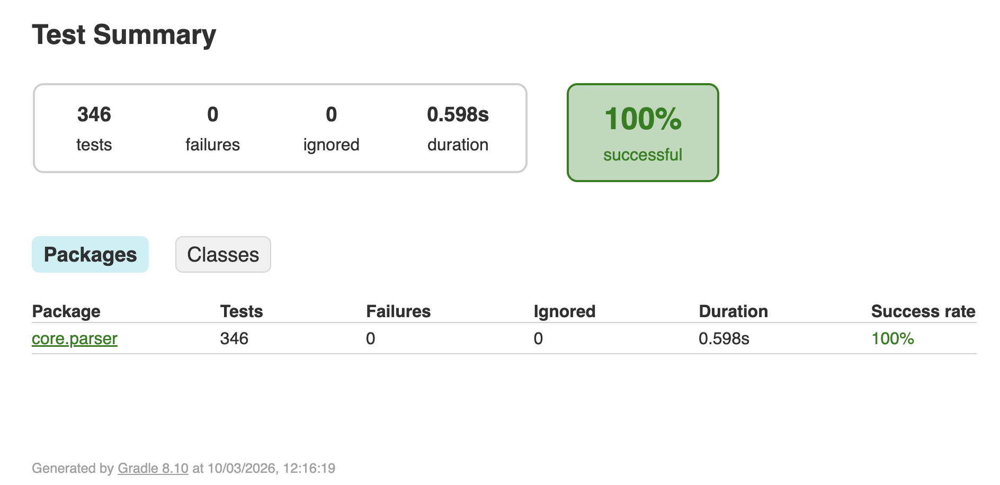

# Compiler Project

For the last delivery (CP3), complete the following sections.

## Participation

The sum of the participations should be 100%, for a group of four elements with balanced participation, this corresponds to 25% participation each.

[João Sousa] - [percentage]% 
[Gustavo Teixeira] - [percentage]% 
[Francisco Bandeira] - [percentage]% 
[Student 4] - [percentage]% 

## Declaration of AI Tools Used

Please choose one of the two options  about AI tools use. In case tools where used, enumerate which ones, and the specific use.

Finally, check the box regarding responsibility for the work.

AI tools/services used in this work:

[] No AI tools were used.
[x] The following tools were used:
 - [ChatGPT]: Utilizado para uma melhor compreensão dos códigos inicialmente fornecidos, bem como ajuda/ complementaridade na documentação do código criado, a partir de um padrão de escrita/documentação previamente definido nas definições da AI. Utilizado na criação de testes extra, para validar casos não abordados pelos testes públicos, assim como casos 'border-line'.
 - [Claude AI]: Pequeno trabalho de debug de alguns erros.

[x] All content has been reviewed, understood, validated, and we assume full responsibility for the work in this repository.

# Repository Structure

The base repository has several folders, the main ones are:

- `src`: The source folder for the project, you will work here.
- `test`: Folder for your own tests.
- `test-public`: Public tests, similar to the majority of the private tests that will be used for evaluation. **Do not change the contents of this folder.** This folder will be modified by automatic updates during the semester.

The remaining folders are:

- `libs`: Libraries in JAR format, required for the project.
- `libs-jmm`: Java code that can be imported in your Java-- classes. Contains a `java` folder, with the source code, and a `compiled` folder with the same classes, in compiled format. The build system automatically compiles the files inside the `java` folder and stores them in the `compiled` folder.

# Extra Tests Results
## CP1
### Parser

  <kbd>
    
  </kbd>

